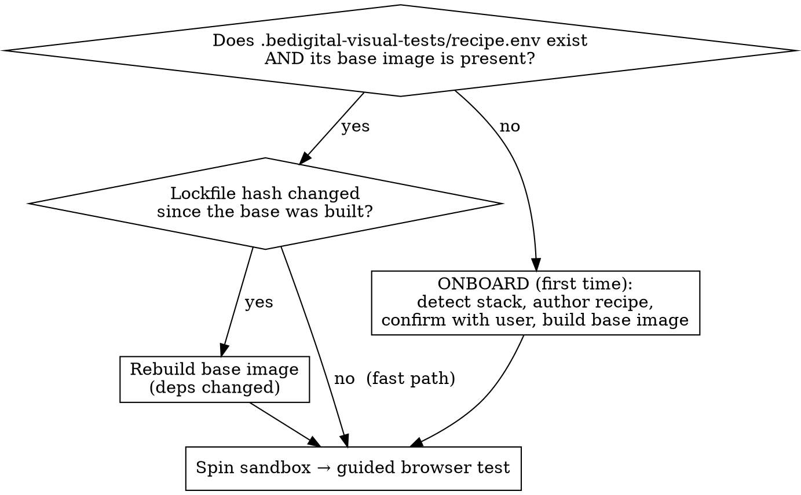

# bedigital-visual-tests

## Overview

Spin the repo you're working on up in a **fresh, isolated Docker sandbox** built from your **committed** code, then drive a **real browser** through it to visually verify what you built — capturing screenshots, console, and network as evidence.

**Core principle:** onboard a repo **once** (build a base image with all dependencies baked in), then every subsequent run reuses that base and boots a disposable sandbox in seconds. You test a reproducible build of what will merge, not your live working tree.

This is the environment + guided-test half. You (or the invoking agent) decide what to check; the skill provisions the sandbox and drives the browser. Auto-planning checks from the diff and delegating persona agents is a future layer, not this skill.

## When to Use

- After a commit / finishing a feature, before opening a PR — "does this actually work in the browser?"
- You want repeatable, isolated browser QA of a repo without hand-rolling Docker each time
- You want screenshot/console/network evidence of a flow working (or breaking)

**When NOT to use:**
- Pure unit/logic testing with no runtime UI → just run the test suite
- You need to test uncommitted scratch edits live with HMR → that's `next dev`, not this (this builds committed code on purpose)
- The v2 "adversarial brain" (auto-decide checks from the diff, multi-agent) — not built yet

## The one decision that matters: onboarded or not?

`scripts/sandbox.sh status` answers this for you. Never re-onboard when already onboarded and the lockfiles are unchanged — that throws away the whole point (reusing the baked base).

## Quick Reference

All commands run from the target repo root. `SKILL_DIR` = this skill's directory.

| Goal | Command |
|------|---------|
| Is this repo onboarded? / is the base current? | `"$SKILL_DIR/scripts/sandbox.sh" status` |
| First-time onboard (after you've authored the recipe) | `"$SKILL_DIR/scripts/sandbox.sh" onboard` |
| Spin a fresh isolated sandbox, print its URL | `"$SKILL_DIR/scripts/sandbox.sh" up` |
| Tear down THIS run's sandbox | `"$SKILL_DIR/scripts/sandbox.sh" down` |
| Remove the base image too (force re-onboard) | `"$SKILL_DIR/scripts/sandbox.sh" nuke` |

`up` prints `SANDBOX_URL=http://localhost:<port>` and `EVIDENCE_DIR=...` — read both from its output; the host port is **ephemeral per run** (never assume 3000).

## Workflow

### 1. Onboard (first time on a repo only)

Follow `reference/onboarding.md`. In short: detect the stack via the signal ladder (existing `docker-compose.yml`/`devcontainer.json`/`Dockerfile` win → lockfile picks the package manager → marker files pick the runtime → scripts infer build/start → else ask), then **write the recipe** into the target repo and **confirm it with the user before building**:

- `.bedigital-visual-tests/recipe.env` — sourced by the scripts (app service, container port, health path, lockfile globs, optional base compose to layer under).
- `.bedigital-visual-tests/sandbox.compose.yml` — the sandbox definition: either a **sanitizing override** layered on the repo's existing compose, or a self-contained compose that builds from `templates/Dockerfile.base.example`.
- Commit `recipe.env` + `sandbox.compose.yml`. `.bedigital-visual-tests/evidence/` is gitignored.

Then run `sandbox.sh onboard` to build the base image. **Secrets are the #1 real blocker** — if the app needs vault keys / JWT / API keys to boot, record them in the recipe and inject throwaway values; the health-gate will otherwise hang. See `reference/gotchas.md`.

### 2. Spin the sandbox

`sandbox.sh up`. It builds from your **committed** code (a detached git worktree of `HEAD`, so uncommitted edits are excluded), uses a **unique project name per run** and an **ephemeral host port** (so runs never collide), waits on the health check, and prints `SANDBOX_URL`.

### 3. Guided browser test

Drive the app at `SANDBOX_URL` with the **agent-browser** skill, following `reference/driving-the-app.md`. Walk the flow the user described, screenshot every meaningful step, capture console + network, and write a `REPORT.md` with a PASS/⚠ verdict per step into `EVIDENCE_DIR`.

### 4. Tear down

`sandbox.sh down`. The base image stays cached for next time.

## Common Mistakes

| Mistake | Fix |
|---------|-----|
| Re-onboarding / rebuilding deps every run | Check `status` first; reuse the base image. Rebuild only on lockfile-hash change. |
| Assuming the app is on port 3000 | Read `SANDBOX_URL` from `up` — the host port is ephemeral per run. |
| Reusing the repo's compose as-is | Layer the sanitizing override: ephemeral ports, throwaway env, drop dev-only services, no host bind-mounts. See `reference/gotchas.md`. |
| Testing the working tree instead of committed code | `up` builds from a detached `HEAD` worktree by design. Commit first. |
| Browser can't log in / blank network tab | Seeded test user + `AUTH_COOKIE_SECURE=false` over HTTP + CORS allows the sandbox origin. |
| App never goes healthy | Almost always missing secrets/env. Read the container logs; inject throwaway secrets in the recipe. |
| Driving a browser *inside* a container to `http://<service>:<port>` | Chromium force-upgrades single-label hosts to HTTPS → `ERR_SSL_PROTOCOL_ERROR`. Use a dotted alias, or (default) drive from the host against the published port. |

## Files

- `scripts/sandbox.sh` — deterministic Docker mechanics (status/onboard/up/down/nuke)
- `templates/recipe.env.example` — the recipe schema, documented
- `templates/sandbox.compose.example.yml` — sanitizing-override + self-contained examples
- `templates/Dockerfile.base.example` — fallback base image when the repo has no Docker assets
- `reference/onboarding.md` — stack detection signal ladder + authoring the recipe + secrets
- `reference/driving-the-app.md` — agent-browser usage + evidence conventions + REPORT.md format
- `reference/gotchas.md` — hard-won failure modes and their fixes
