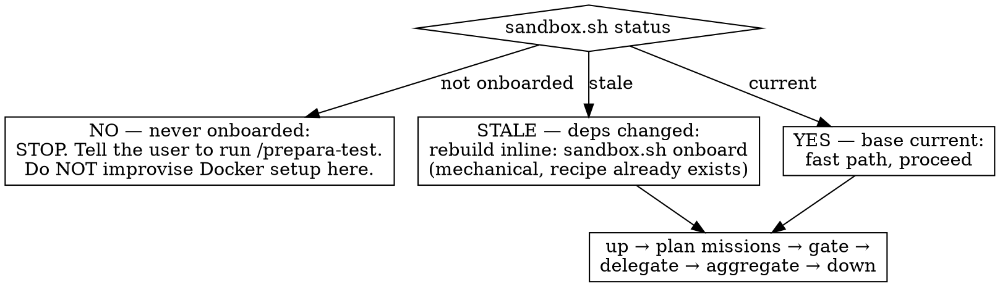

# esegui-test

> **TRUST BOUNDARY — read before running on a repo you didn't write.** This skill executes the target repo's **committed `.bedigital-visual-tests/recipe.env` as a shell script on your host** (`sandbox.sh` does `source recipe.env`), and its `RESET_CMD` runs via `bash -c` on the host too — neither is sandboxed inside Docker. Only the app code is isolated; the recipe is not. A malicious recipe could run arbitrary commands on your machine. **Only run this skill on repositories you trust.**

**REQUIRED COMPANION:** the `prepara-test` skill owns creating and repairing the sandbox environment (recipe + base image). This skill only *runs* tests on an environment that already works.

## Overview

Spin the repo you're working on up in a **fresh, isolated Docker sandbox** built from your **committed** code, then drive a **real browser** through it to visually verify what you built — capturing screenshots, console, and network as evidence.

On each run the skill **reads what changed**, decides a few **targeted adversarial missions** (tied to the diff, optionally steered by a spec/plan brief), delegates **one browser-driving agent per mission**, and aggregates findings — each failure with a runnable repro + a short fix suggestion. You approve the mission list before it runs (unless `--auto`).

## When to Use

- After a commit / finishing a feature, before opening a PR — "does this actually work in the browser?"
- You want repeatable, isolated browser QA of an onboarded repo
- You want screenshot/console/network evidence of a flow working (or breaking)

**Invocation** (single command — no subcommands, no modes):
- `/esegui-test` → plan missions from the diff, show them, approve, run
- `/esegui-test "check X and that Y still works"` → your words seed the missions
- `/esegui-test --auto` → plan + run with no approval gate, report at the end (for hands-off callers)

**Where to run it from:** the checkout whose `HEAD` is the work to test — `sandbox.sh up`
builds the `HEAD` of the repo at your cwd. For an orchestrator worker agent that's your
own worktree (linked worktrees are fully supported); if you're not already there, enter
your worktree *before* the preflight. Do NOT create a new worktree just for testing —
isolation is already `sandbox.sh`'s job (it builds from its own detached-HEAD worktree).

**When NOT to use:**
- The repo has no `.bedigital-visual-tests/recipe.env`, or the environment is broken → that's `prepara-test`, not this
- Pure unit/logic testing with no runtime UI → just run the test suite
- You need to test uncommitted scratch edits live with HMR → that's `next dev`, not this (this builds committed code on purpose)

## Preflight: the boundary check

Run `"$SKILL_DIR/scripts/sandbox.sh" status` first. Three outcomes:

**Not onboarded = hard stop.** Even if you can see a Dockerfile and could wire it up yourself — don't. Onboarding has its own skill (`prepara-test`) with the recipe contract, doctor preflight, secrets/auth/seeding decisions, and a user-confirmation gate. Improvising here produces exactly the half-onboarded environments that skill exists to prevent.

## Quick Reference

All commands run from the target repo root. `SKILL_DIR` = this skill's directory.

| Goal | Command |
|------|---------|
| Is this repo onboarded? / is the base current? | `"$SKILL_DIR/scripts/sandbox.sh" status` |
| Rebuild a STALE base (deps changed; recipe exists) | `"$SKILL_DIR/scripts/sandbox.sh" onboard` |
| Spin a fresh isolated sandbox, print its URL | `"$SKILL_DIR/scripts/sandbox.sh" up` |
| Restore a clean seeded DB between missions | `"$SKILL_DIR/scripts/sandbox.sh" reset` |
| Tear down THIS run's sandbox | `"$SKILL_DIR/scripts/sandbox.sh" down` |

`up` prints `SANDBOX_URL=http://localhost:<port>` and `EVIDENCE_DIR=...` — read both from its output; the host port is **ephemeral per run** (never assume 3000). If the recipe has auth configured, `up` also echoes `TEST_USER`/`TEST_PASSWORD`/`LOGIN_PATH`/`POST_LOGIN_PATH` — pass them verbatim to each delegate so it can log in through the real form.

## Workflow

### 1. Preflight

`sandbox.sh status` → hard-stop / inline rebuild / proceed, per the flowchart above. Never re-onboard when status says the base is current — that throws away the whole point (reusing the baked base).

### 2. Spin the sandbox

`sandbox.sh up`. It builds from your **committed** code (a detached git worktree of `HEAD`, so uncommitted edits are excluded), uses a **unique project name per run** and an **ephemeral host port** (so runs never collide), seeds the DB per the recipe's `SEED_STRATEGY`, waits on the health check, and prints `SANDBOX_URL` + `EVIDENCE_DIR` (+ auth keys if set).

### 3. Plan → gate → execute → report

The autonomous review flow. Full playbook in **`reference/reviewing.md`**; in short:

- **PLAN** (you, the agent running the skill — the *planner*): read `git diff <base>...HEAD` + the commit/PR message + repo routes + the optional brief, and produce a few **targeted adversarial missions** (each tied to the diff). Mission schema + rules are in `reference/reviewing.md`.
- **GATE**: interactive by default — show the mission list, let the user approve/edit/drop/add. With `--auto`, skip and proceed. (This *is* how you steer — there's no separate guided mode.)
- **EXECUTE** (sequential, one mission at a time): `sandbox.sh reset` (clean seeded DB, app restarted in place, health re-gated) → spawn **one delegate subagent** (model = recipe `DELEGATE_MODEL`, default Sonnet 5) with the mission + `SANDBOX_URL` + `EVIDENCE_DIR` + the auth keys → it drives agent-browser per `reference/driving-the-app.md` and returns a finding (pass → evidence; fail → evidence + runnable repro + short fix suggestion).
- **AGGREGATE**: write `REVIEW.md` (agent-facing) into `EVIDENCE_DIR`, then build a self-contained **`review.html`** (screenshots inlined, a storyboard per mission) via `scripts/build-report.js` and **publish it as a shareable Artifact** when the `Artifact` tool is available — see `reference/reporting.md`. Report inline, findings ranked most-severe first, with the artifact link.

**Model policy:** the planner runs at the *session* model (launch the skill under a strong model for good missions); delegates are spawned as `DELEGATE_MODEL` subagents. Both set in `recipe.env`.

### 4. Tear down

`sandbox.sh down`. The base image stays cached for next time.

## Common Mistakes

| Mistake | Fix |
|---------|-----|
| Improvising Docker setup on a non-onboarded repo | Hard stop. `/prepara-test` owns onboarding — recipe contract, doctor, secrets, user confirmation. |
| Re-onboarding / rebuilding deps every run | Check `status` first; reuse the base image. Rebuild only when status says STALE. |
| Assuming the app is on port 3000 | Read `SANDBOX_URL` from `up` — the host port is ephemeral per run. |
| Testing the working tree instead of committed code | `up` builds from a detached `HEAD` worktree by design. Commit first. |
| Running from the wrong checkout (e.g. main instead of your own worktree) | You'd test the wrong `HEAD`. Run from the checkout whose `HEAD` is the work under test; entering your existing worktree first is correct. Creating a *new* worktree for the test is not — `sandbox.sh` already isolates. |
| Delegate can't log in | Pass the `TEST_USER`/`TEST_PASSWORD`/`LOGIN_PATH` keys `up` echoed. If the seeded user is rejected, that's a recipe bug → `/prepara-test`. |
| App never goes healthy on `up` | Almost always missing secrets/env — an environment problem. Read the container logs, then fix it via `/prepara-test` (see its gotchas pointer). |
| Driving a browser *inside* a container to `http://<service>:<port>` | Chromium force-upgrades single-label hosts to HTTPS → `ERR_SSL_PROTOCOL_ERROR`. Use a dotted alias, or (default) drive from the host against the published port. |
| Running missions in parallel | They share one app + DB and would corrupt each other. Run sequentially with `sandbox.sh reset` between them. |
| A broad mission list "to be thorough" | Missions must be diff-scoped and few (2–5). Each is a real subagent + wall-clock. Tie every mission to the change. |
| Skipping `reset` between missions | Adversarial missions mutate state; the next mission then starts dirty. Always `reset` first. |

## Files

- `scripts/sandbox.sh` — deterministic Docker mechanics (status/doctor/onboard/up/reset/down/nuke). Shared with `prepara-test`, which calls it from this directory.
- `scripts/doctor-compose.js` — Node (no deps): structural checks on the rendered compose, used by `doctor`
- `scripts/build-report.js` — Node (no deps): findings.json + evidence → self-contained `review.html`
- `reference/reviewing.md` — the review playbook: planner (diff → missions), delegate (drive + repro + fix), aggregator (REVIEW.md)
- `reference/reporting.md` — the rich report: findings.json → `review.html` (inlined screenshots + storyboard) → published Artifact
- `reference/driving-the-app.md` — agent-browser usage + logging in + evidence conventions + REPORT.md format
- `reference/gotchas.md` — hard-won failure modes and their fixes (run-time AND onboard-time; `prepara-test` links here too)

Onboarding material (recipe authoring, templates, Supabase stack, data snapshot) lives in the **`prepara-test`** sibling skill.
